<!-- Vinod Atwal — GitHub Profile -->

### Vinod Atwal · Senior Software Engineer

8+ years building distributed, secure backend systems — **software supply-chain security** (SLSA L3, SBOM/VEX, code signing, PKI), **identity platforms** (OAuth2/OIDC, passkeys/WebAuthn) and cloud-native architecture. Hands-on with **Java, Go, Kubernetes and AWS**.

---

### Featured projects

- **[sievegate](https://github.com/VinodAtwal/sievegate)** — Go · API contract testing that detects discrepancies between a spec and the live implementation and logs them for triage.
- **[admission-controller-poc](https://github.com/VinodAtwal/admission-controller-poc)** — Go · Kubernetes admission controller PoC for policy-gated, attestation-checked workloads.
- **[embedded-infinispan](https://github.com/VinodAtwal/embedded-infinispan)** — Java · Spring Boot with an embedded Infinispan distributed cache cluster.
- **[maxscale-galera-k8s](https://github.com/VinodAtwal/maxscale-galera-k8s)** — Shell · MariaDB Galera multi-master cluster on Kubernetes, fronted by MaxScale routing.
- **[BigCSVHandler](https://github.com/VinodAtwal/BigCSVHandler)** — Approaches for efficient reading and writing of very large files.
- **[ObjectProxy](https://github.com/VinodAtwal/ObjectProxy)** — Java · Runtime proxy creation via JDK dynamic proxies and cglib.

[Show all repositories →](https://github.com/VinodAtwal?tab=repositories)

---

### Tech stack

**Languages:** Java, Go, Python, SQL, Bash

**Backend & data:** Spring Boot, PostgreSQL, Redis, Apache Kafka, MongoDB

**Security, cloud & identity:** SLSA L3 · SBOM/VEX · PKI & Code Signing · OAuth2/OIDC · AWS · Kubernetes

---

### GitHub statistics

  <picture>
    <source media="(prefers-color-scheme: dark)" srcset="./profile/stats-dark.svg">
    
  </picture>
  <picture>
    <source media="(prefers-color-scheme: dark)" srcset="./profile/top-langs-dark.svg">
    
  </picture>

---

### Latest from my blog

- **[How Three MariaDB Servers Behave Like One: The Truth About Galera and MaxScale](https://vinodatwal.medium.com/how-three-mariadb-servers-behave-like-one-the-truth-about-galera-and-maxscale-5671d0e5d990)** — synchronous multi-master replication, quorum math, and MaxScale routing.
- **[Kubernetes Admission Controllers, Explained](https://vinodatwal.medium.com/kubernetes-admission-controllers-explained-what-they-are-and-how-they-actually-work-7e23ef4b5d82)** — what they are and how they actually work.
- **[A Deep Dive Into Merkle Trees in Dynamo and Cassandra](https://vinodatwal.medium.com/i-went-down-a-rabbit-hole-on-merkle-trees-in-dynamo-and-cassandra-heres-what-i-found-9113b133e016)** — how Merkle trees make anti-entropy reconciliation work.

---

### Connect

  
  
  

