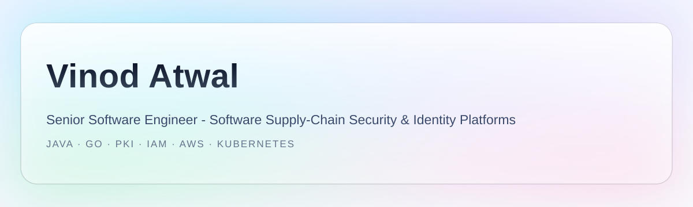
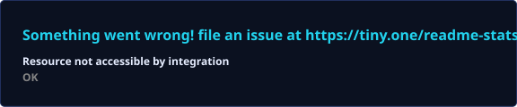

<!-- Vinod Atwal — GitHub Profile -->

<picture>
  <source media="(prefers-color-scheme: dark)" srcset="./assets/banner-dark.svg">
  
</picture>

 

<h2 align="center">About me</h2>

  Senior Software Engineer with <b>8+ years</b> building distributed, secure backend systems — specializing in
  <b>software supply-chain security</b> (SLSA L3, SBOM/VEX, code signing, PKI) and <b>identity platforms</b>
  (OAuth2/OIDC, passkeys/WebAuthn) serving <b>100K+ users</b>. Hands-on with <b>Java, Go, Kubernetes and AWS</b>.

 

<h2 align="center">Featured projects</h2>

<table align="center">
  <tr>
    <td width="50%">
      <b><a href="https://github.com/VinodAtwal/sievegate">sievegate</a></b> · <b>Go</b> 
      API contract testing that detects discrepancies between a spec and the live implementation and logs them for triage.
       
      
      
    </td>
    <td width="50%">
      <b><a href="https://github.com/VinodAtwal/admission-controller-poc">admission-controller-poc</a></b> · <b>Go</b> 
      Kubernetes admission controller PoC for policy-gated, attestation-checked workloads.
       
      
      
    </td>
  </tr>
  <tr>
    <td width="50%">
      <b><a href="https://github.com/VinodAtwal/embedded-infinispan">embedded-infinispan</a></b> · <b>Java</b> 
      Spring Boot with an embedded Infinispan distributed cache cluster.
       
      
      
    </td>
    <td width="50%">
      <b><a href="https://github.com/VinodAtwal/maxscale-galera-k8s">maxscale-galera-k8s</a></b> · <b>Shell</b> 
      MariaDB Galera multi-master cluster on Kubernetes, fronted by MaxScale routing.
       
      
      
    </td>
  </tr>
  <tr>
    <td width="50%">
      <b><a href="https://github.com/VinodAtwal/BigCSVHandler">BigCSVHandler</a></b> · <b>Data</b> 
      Approaches for efficient reading and writing of very large files.
       
      
    </td>
    <td width="50%">
      <b><a href="https://github.com/VinodAtwal/ObjectProxy">ObjectProxy</a></b> · <b>Java</b> 
      Runtime proxy creation via JDK dynamic proxies and cglib.
       
      
      
    </td>
  </tr>
</table>

 

<h2 align="center">Tech stack</h2>

  <b>Languages</b> 
  
  
  
  
  

  <b>Backend & data</b> 
  
  
  
  
  

  <b>Security, cloud & identity</b> 
  
  
  
  
  
  

 

<h2 align="center">GitHub analytics</h2>

  
  

 

<h2 align="center">Latest from my blog</h2>

<ul>
  <li>
    <b><a href="https://vinodatwal.medium.com/how-three-mariadb-servers-behave-like-one-the-truth-about-galera-and-maxscale-5671d0e5d990">How Three MariaDB Servers Behave Like One: The Truth About Galera and MaxScale</a></b> 
    synchronous multi-master replication, quorum math, and MaxScale routing — verified by running the stack.
  </li>
  <li>
    <b><a href="https://vinodatwal.medium.com/kubernetes-admission-controllers-explained-what-they-are-and-how-they-actually-work-7e23ef4b5d82">Kubernetes Admission Controllers, Explained: What They Are and How They Actually Work</a></b> 
    how admission controllers gate everything that enters a cluster, and how to write one.
  </li>
  <li>
    <b><a href="https://vinodatwal.medium.com/i-went-down-a-rabbit-hole-on-merkle-trees-in-dynamo-and-cassandra-heres-what-i-found-9113b133e016">I Went Down a Rabbit Hole on Merkle Trees in Dynamo and Cassandra</a></b> 
    how Merkle trees make anti-entropy reconciliation work in distributed systems.
  </li>
</ul>

  <a href="https://vinodatwal.medium.com/">Read more on Medium →</a>

 

<h2 align="center">Connect</h2>

  
  
  

  <small>© 2026 Vinod Atwal · Built on GitHub</small>

